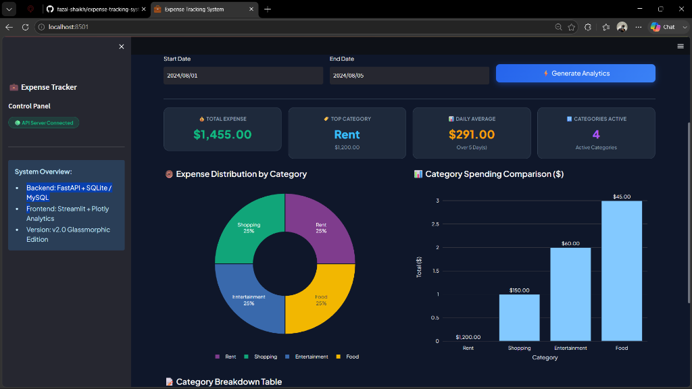
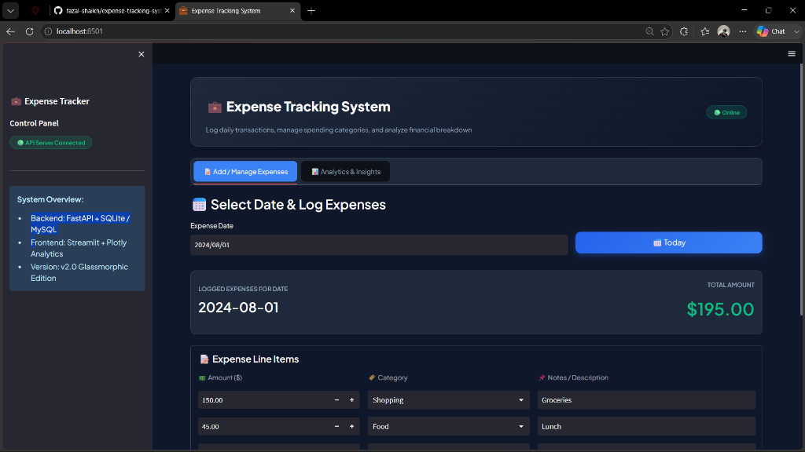

# 💼 Expense Tracking System

A full-stack financial expense tracking application featuring a modern **Streamlit** dark glassmorphism dashboard and a robust **FastAPI** backend with automatic SQLite / MySQL storage fallback.

---

## 📸 Application Screenshots

### 📊 Analytics & Insights Dashboard


### 📝 Add & Manage Expenses Interface


---

## 🌟 Key Features

- **🎨 Modern Glassmorphic UI**: High-end FinTech dark theme with responsive typography and styled card containers.
- **📝 Daily Expense Logging**: Track multiple line items per date with category selection (Shopping, Food, Rent, Entertainment, Transport, Utilities, Other).
- **💡 Real-Time Analytics & Charts**: Interactive Plotly Donut Chart (Category Distribution) and Bar Chart (Spending Breakdown).
- **📊 Metric Cards**: Instant calculation of Total Spent, Top Category, Daily Average Expense, and Active Categories.
- **⚡ Dual Storage Backend**: Automatic fallback to SQLite (`backend/expense_manager.db`) when MySQL is offline for zero-setup execution out of the box.

---

## 📁 Repository Structure

```
├── assets/
│   ├── analytics_dashboard_ui.png # Analytics dashboard screenshot
│   └── add_manage_expenses_ui.png # Expense entry interface screenshot
├── backend/
│   ├── server.py             # FastAPI REST endpoints (/expenses, /analytics/summary)
│   ├── db_helper.py          # Database connector (MySQL + SQLite fallback)
│   └── logging_setup.py      # Logger configuration
├── frontend/
│   ├── app.py                # Main Streamlit UI entry point
│   ├── add_update_ui.py      # Add/Manage Expenses tab UI component
│   └── analytics_ui.py       # Analytics & Plotly charts tab UI component
├── tests/                    # Pytest test suites
├── requirements.txt          # Python project dependencies
└── README.md                 # Project documentation
```

---

## 🚀 Quick Start Guide

### 1. Clone the Repository
```bash
git clone https://github.com/fazal-shaikh/expense-tracking-system.git
cd expense-tracking-system
```

### 2. Install Dependencies
```bash
pip install -r requirements.txt
```

### 3. Launch Backend API Server
```bash
python -m uvicorn backend.server:app --reload --port 8000
```
*(Runs on [http://localhost:8000](http://localhost:8000))*

### 4. Launch Frontend Web App
```bash
python -m streamlit run frontend/app.py
```
*(Open [http://localhost:8501](http://localhost:8501) in your browser)*

---

## 🛠️ Tech Stack

- **Frontend**: Streamlit, Plotly Express, Pandas
- **Backend**: FastAPI, Uvicorn, Pydantic
- **Database**: SQLite (built-in fallback) / MySQL Connector